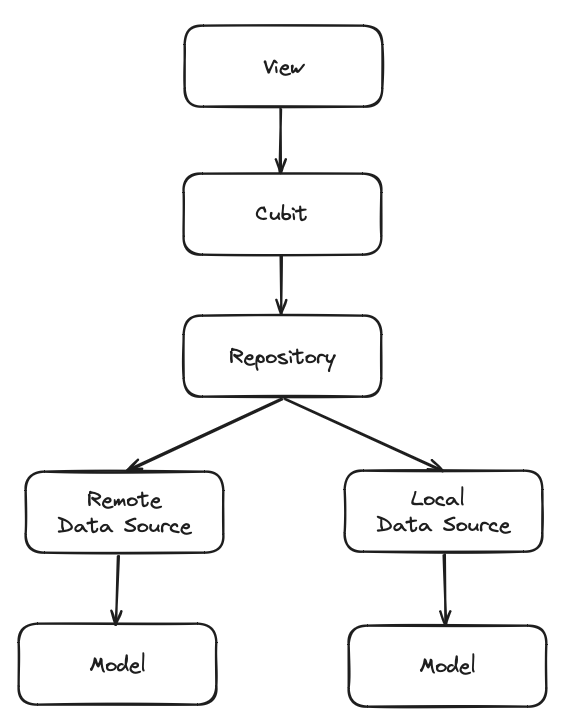

# FlutterCosChallenge

A Flutter project to complete the [Car On Sale (COS) challenge](https://gist.github.com/akaTJ/9081fdd1aed3bd8a051ef6de96bf54bf). **All the requirements and bonus tasks were completed**.

You can check a Demo for the challenge on [YouTube](https://youtu.be/NPm5KtscCLw).

## Architecture and design
The project includes examples of unit, widget, and golden tests and utilizes Cubits for state management, Get It for dependency injection, and other useful packages to facilitate testing. The architecture follows the image below:

 

## Getting Started

- Clone this project
- You need to have [Flutter](https://docs.flutter.dev/get-started/install) installed and set up to run the project.
- `cd` into the repo folder
- Run `flutter pub get` to install all dependencies
- Run the project (`flutter run`)
